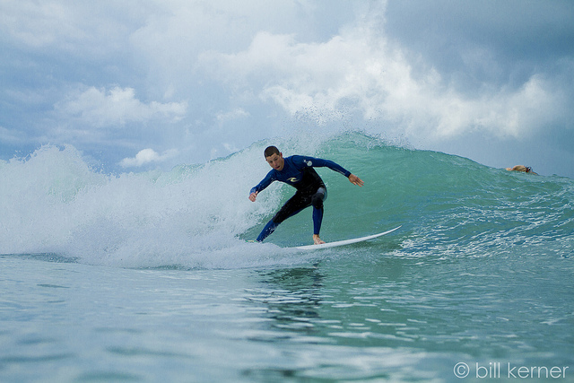
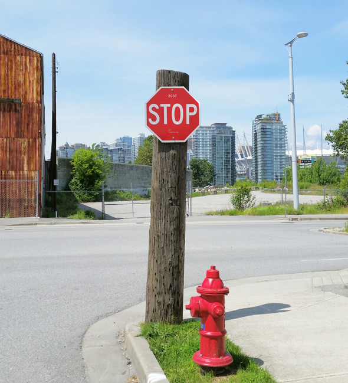

_**Visual Question Answering** can be defined as the problem of trying to produce answers by analyzing the information in the picture._

_In this problem, the questions expressed in the form of texts are a **Natural Language Processing** problem; each question in the production of answers within the pictures indicates a separate **Computer Vision** problem._

**_If we look at the system in general:_**

*
---

**_Data sets developed for the Visual Question Answering task and frequently used in studies in the literature_**

* [DAQUAR](https://www.mpi-inf.mpg.de/departments/computer-vision-and-multimodal-computing/research/vision-and-language/visual-turing-challenge/)
* [COCO-QA](https://github.com/renmengye/imageqa-public/tree/master/data)
* [VQA](https://visualqa.org/index.html)
* [FM-IQA](http://research.baidu.com/Downloads)
* [VISUAL GENOME](https://visualgenome.org/)
* [VISUAL7W](http://web.stanford.edu/~yukez/visual7w/)
---

---

(_Requirements_): 

* [Tensorflow (Ver. 1.2+)](https://www.tensorflow.org/install/pip)
* [Keras (Ver. 2.0+)](https://pypi.org/project/Keras/)
* [scikit-learn](https://scikit-learn.org/stable/install.html)
* [Spacy (Ver 2.0+)](https://spacy.io/usage/)
     _Used to load Glove vectors (word2vec)_
    * _To upgrade & install Glove Vectors_
       * python -m spacy download en_vectors_web_lg
       
* [OpenCV](https://pypi.org/project/opencv-python/)

---
_Sample predictions_

_Some answers predicted by the VQA model._

Q: How is the weather? 
A: Sunny! (%97.23)

Q: How many girls are in the picture?
A: 2! (%61.98)

Q: What is done in the picture?
A: Surfing! (%99.43)

Q: What does the sign say?
A: Stop! (%28.61)

--- _References_

*
